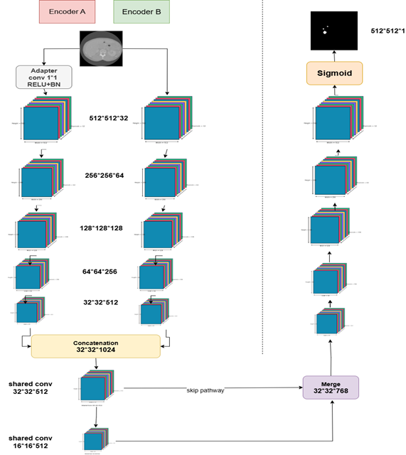
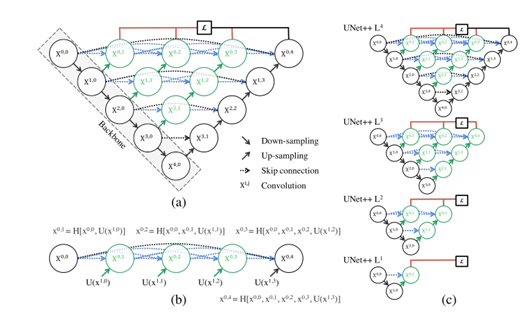
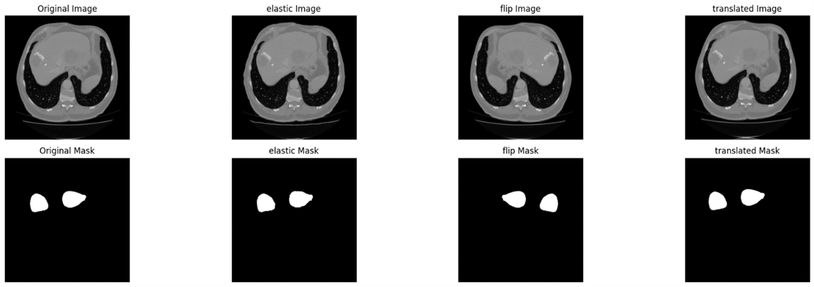
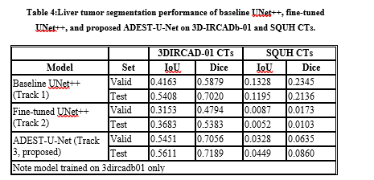
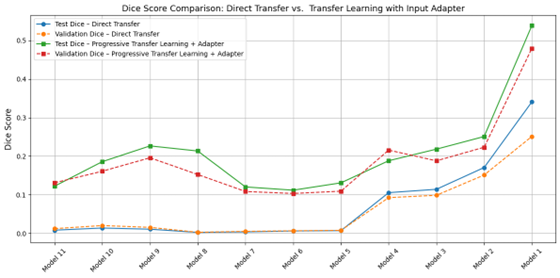
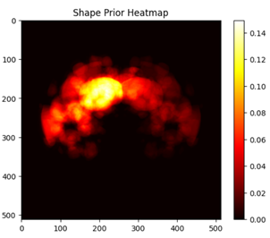
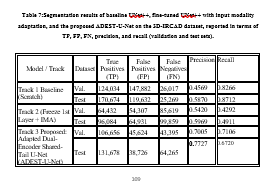

# 🧠 ADEST-U-Net: Dual-Encoder Transfer Learning Architecture for Cross-Organ and Cross-Modality Medical Image Segmentation  

This repository contains the official implementation of my MSc thesis:  
**“ADEST-U-Net: Dual-Encoder Transfer Learning Architecture for Cross-Organ and Cross-Modality Medical Image Segmentation”**  
(Sultan Qaboos University, 2025).  

---

## 📑 Abstract  

Medical image segmentation, the process of delineating anatomical structures and pathologies from CT and MRI, plays a vital role in clinical decision-making, surgical planning, and treatment monitoring. However, its accuracy is constrained by the scarcity of annotated datasets, since expert labeling is costly and labor-intensive. Transfer learning offers a promising solution by reusing pretrained models to reduce data requirements and improve generalization.  

This thesis addresses one of the most constrained scenarios: **when no pretrained models exist for the same organ or modality.** In such cases, cross-organ and cross-modality transfer becomes essential. We investigate the adaptation of knowledge from **brain tumor MRI** to **liver tumor CT** segmentation, thereby extending the benefits of transfer learning to settings of extreme data scarcity.  

To this end, we propose the **Adapted Dual-Encoder Shared-Tail U-Net (ADEST-U-Net)**, a hybrid architecture with two complementary encoders:  
- One initialized with **MRI-pretrained weights** (from brain tumor segmentation).  
- One trained from scratch on **liver CT**.  

The encoder features are concatenated, refined via shared convolutional blocks, and decoded into tumor masks, enabling effective **cross-domain feature alignment**.  

**Key findings**:  
- ADEST-U-Net achieved a **Dice score of 0.7189**, outperforming both scratch-trained UNet++ (+1.7 points) and MRI-pretrained UNet++ (+18.0 points).  
- Reduced false positives significantly (−67.6% vs. baseline UNet++, −40.4% vs. fine-tuned UNet++).  
- Qualitative results showed predictions were better confined to the liver parenchyma, avoiding invalid extrahepatic detections.  

**Limitations**:  
- Difficulty detecting very small tumors.  
- Large performance drop in cross-dataset evaluation (SQUH vs. 3DIRCADb-01), revealing sensitivity to scanner types, protocols, and annotation style.  
- No lesion-wise analysis was performed, so weaknesses in small-lesion detection may be underestimated.  

---

## 🔑 Contributions  

- First systematic study of **cross-organ, cross-modality transfer learning** in tumor segmentation.  
- Proposed **ADEST-U-Net**, a novel dual-encoder hybrid designed for domain-shift scenarios.  
- Released **raw and processed datasets (3DIRCADb-01 + SQUH)** and reproducible code.  
- Conducted **comparative experiments**:  
  - Track 1: Baseline UNet++ (scratch).  
  - Track 2: Fine-tuned UNet++ with MRI pretrained weights.  
  - Track 3: ADEST-U-Net (proposed).  
- Highlighted **clinical implications** and **limitations** (small lesions, domain adaptation needs).  

---

## 📊 Figures  

This repository includes visualization figures used in the thesis:  

- **Proposed ADEST-U-Net (dual-encoder shared-tail design):**  
    

- **Baseline UNet++ architecture:**  
    

These diagrams illustrate the architectural differences and highlight how the dual-encoder approach improves cross-organ and cross-modality feature transfer.


## 📊 Datasets  

Both **raw** and **processed** datasets are available via Google Drive:  

- **3D-IRCADb-01 (CT, public)**: [Link](https://drive.google.com/drive/folders/10keDJW1yJ3N22KUXTjkYhdpNmf-dp_ZA)  
- **SQUH Clinical Dataset (CT, private collaboration)**: [Link](https://drive.google.com/drive/folders/1dNk0K4zb-1dG7QA9naqK4uR0QV_zSME9)  

- *Raw*: Original CT volumes + segmentation masks.  
- *Processed*: Slice extraction, splitting, augmentation.  
- *Preprocessing*: Normalization, resizing, and dimension adjustments are handled dynamically in `preprocessing_pipeline.py`.  

---

## ⚙️ Workflow  

1. **Data Preparation**  
   - Use `preparation_and_processing.ipynb` if starting from raw data.  
   - Or directly load processed slices.  

2. **Baseline (Track 1)** – UNet++ trained from scratch.  
3. **Fine-Tuning (Track 2)** – UNet++ initialized with **brain MRI weights**.  
   - Pretrained weights from [UNet++ Brain Tumor Segmentation Repo](https://github.com/sauravmishra1710/UNet-Plus-Plus---Brain-Tumor-Segmentation).  
4. **Proposed (Track 3)** – ADEST-U-Net with dual encoders (MRI-pretrained + CT-specific).  
5. **Evaluation** – Quantitative (Dice, IoU) and qualitative (visual overlays).  
6. **Ablation Studies** – Component-level analysis.  

---

## 💾 Model Weights  

The trained model weights for this project are available on Google Drive:  

🔗 [Download Model Weights (best_models_weights.rar)](https://drive.google.com/drive/folders/184IwcG1Bm5M8UFOJJ-tOeZqVi7Ue2mmg)  

⚠️ Note: Model weights are not included in this repository due to GitHub’s 100 MB file size limit.  
Please download them from the above link and place them inside the `models_weights/` folder before running evaluation notebooks.  


## 🏥 Clinical Implications  

- Can serve as a **pre-annotation tool** to reduce radiologists’ manual effort.  
- Produces **consistent, reproducible tumor contours** → reduces inter-observer variability.  
- Potential for **integration into PACS** for real-time overlays.  
- Valuable for **multidisciplinary tumor boards**, enabling faster disease-burden visualization.  
- Limitations acknowledged:  
  - Weakness on **small lesions** (need lesion-wise metrics in future).  
  - Domain shifts (scanner/annotation differences) → performance drops.  
  - Future work: advanced **domain adaptation**, **size-aware losses**, and **multi-scale refinements**.  

---


## 📊 Results & Visualizations

Below are sample figures generated during the experiments:

### Data Augmentation



The repository also provides **sample qualitative results** comparing the three experimental tracks:  

- **Track 1 (Scratch, UNet++)** – baseline trained directly on liver CT.  
- **Track 2 (Cross-organ + modality adaptation, UNet++)** – pretrained on brain MRI with modality adapter.  
- **Track 3 (ADEST-U-Net, proposed)** – dual-encoder architecture integrating MRI-pretrained features with CT-specific learning.  

These visualizations show CT slices (left), their ground-truth masks, and segmentation predictions from each track.  
They highlight that **ADEST-U-Net (Track 3)** improves tumor boundary delineation and reduces false positives compared to baseline models.  

  
*Comparison across tracks on multiple CT slices (set 1).*  

  
*Comparison across tracks on multiple CT slices (set 2).*  

  
*Comparison across tracks on multiple CT slices (set 3).*  

### In-domain vs Cross-dataset Evaluation


### Score Comparison Across Freezing Strategies


### Shape Prior Heatmap


### Qualitative Analysis


---

📂 Additional result slides are available in:
- [`results.pptx`](outputs/results.pptx)


## 📜 Citation  

If you use this code or dataset, please cite:  

> Riham Adil Ali. *ADEST-U-Net: Dual-Encoder Transfer Learning Architecture for Cross-Organ and Cross-Modality Medical Image Segmentation*. MSc Thesis, Sultan Qaboos University, 2025.  

---

## 📧 Contact  

For questions or collaborations:  

- 📩 **rihamadilali1@gmail.com**  
- 📩 **s132329@student.squ.edu.om**  


## 📦 Installation  

```bash
git clone https://github.com/<your-username>/thesis-segmentation.git
cd thesis-segmentation
pip install -r requirements.txt

